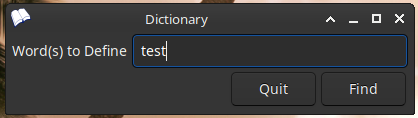
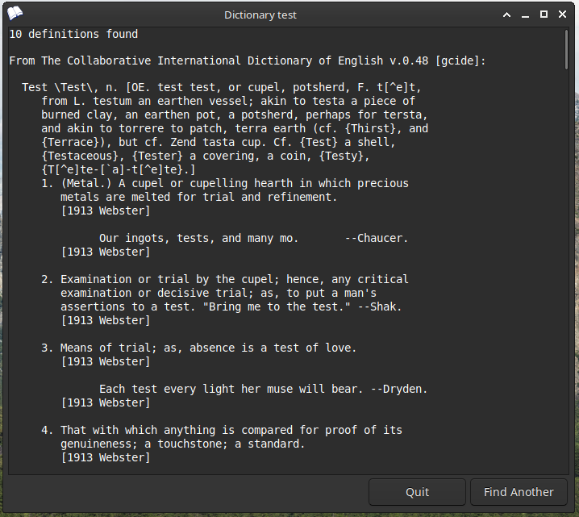
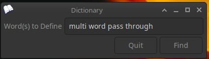
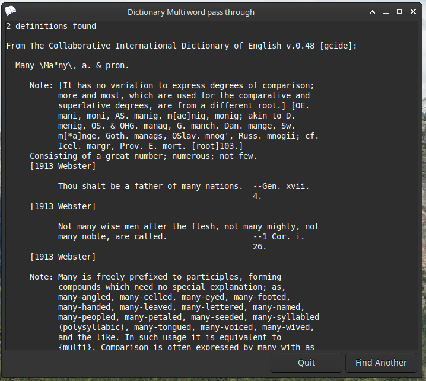

# Dictionary

## Description
Dictionary is a Linux Desktop Application designed as a command line interface for the 'dict' program. It offers a user-friendly way to access definitions and meanings of words directly from your desktop.

## Features

### Example 1: Single Word Definitions
Get definitions for single words quickly and efficiently.

Step 1:

Step 2:

### Example 2: Multi-Word Definitions
Easily lookup definitions for phrases or multi-word queries.

Step 1:

Step 2:

## Requirements
To use Dictionary, you need to have the following installed on your Linux system:
- `yad`: For the graphical interface.
- `dict`: The core dictionary command line program.

## Installation
Copy all files to persective directories.

## License
The 2-Clause BSD License # https://opensource.org/license/bsd-2-clause/
Copyright 2024 Gregory Wienands
Redistribution and use in source and binary forms, with or without modification, are permitted provided that the following conditions are met:
1. Redistributions of source code must retain the above copyright notice, this list of conditions and the following disclaimer.
2. Redistributions in binary form must reproduce the above copyright notice, this list of conditions and the following disclaimer in the documentation and/or other materials provided with the distribution.
THIS SOFTWARE IS PROVIDED BY THE COPYRIGHT HOLDERS AND CONTRIBUTORS “AS IS” AND ANY EXPRESS OR IMPLIED WARRANTIES, INCLUDING, BUT NOT LIMITED TO, THE IMPLIED WARRANTIES OF MERCHANTABILITY AND FITNESS FOR A PARTICULAR PURPOSE ARE DISCLAIMED. IN NO EVENT SHALL THE COPYRIGHT HOLDER OR CONTRIBUTORS BE LIABLE FOR ANY DIRECT, INDIRECT, INCIDENTAL, SPECIAL, EXEMPLARY, OR CONSEQUENTIAL DAMAGES (INCLUDING, BUT NOT LIMITED TO, PROCUREMENT OF SUBSTITUTE GOODS OR SERVICES; LOSS OF USE, DATA, OR PROFITS; OR BUSINESS INTERRUPTION) HOWEVER CAUSED AND ON ANY THEORY OF LIABILITY, WHETHER IN CONTRACT, STRICT LIABILITY, OR TORT (INCLUDING NEGLIGENCE OR OTHERWISE) ARISING IN ANY WAY OUT OF THE USE OF THIS SOFTWARE, EVEN IF ADVISED OF THE POSSIBILITY OF SUCH DAMAGE.

